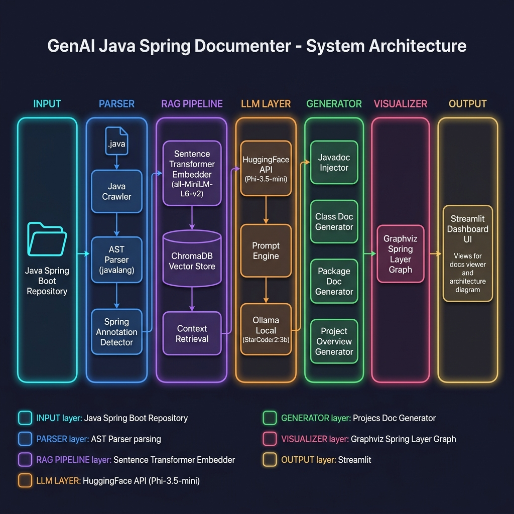

<p align="center">
  <h1 align="center">🏗️ GenAI Java Spring Documenter</h1>
  <p align="center">
    <b>AI-Powered Documentation Generator for Java Spring Boot Microservices</b>
  </p>
  <p align="center">
    
    
    
    
    
  </p>
</p>

---

## 📖 Overview

**GenAI Java Spring Documenter** is an AI-powered tool that automatically generates comprehensive documentation for Java Spring Boot projects. It uses a **Retrieval-Augmented Generation (RAG)** pipeline to produce context-aware Javadocs, Markdown class documentation, package summaries, project overviews, and visual architecture diagrams — all from a single click in an interactive Streamlit dashboard.

### ✨ Key Features

| Feature | Description |
|---|---|
| 🔍 **Java AST Parsing** | Parses `.java` files using `javalang` to extract classes, methods, fields, and annotations |
| 🧠 **RAG Pipeline** | Embeds code into ChromaDB using Sentence Transformers for context-aware generation |
| 📝 **Javadoc Injection** | Automatically generates and injects Javadoc comments directly into source files |
| 📄 **Markdown Documentation** | Generates per-class, per-package, and project-level Markdown docs |
| 📊 **Architecture Visualization** | Creates Spring layer dependency graphs using Graphviz |
| 🤖 **Dual LLM Support** | Supports both HuggingFace Inference API (Phi-3.5-mini) and local Ollama (StarCoder2:3b) |
| 🎛️ **Streamlit Dashboard** | Interactive web UI for one-click documentation generation and viewing |

---

## 🏛️ System Architecture



The system follows a **multi-stage pipeline architecture** with six core layers:

### Architecture Flow

```
┌─────────────────────────────────────────────────────────────────────────────┐
│                        GenAI Java Spring Documenter                        │
├─────────────────────────────────────────────────────────────────────────────┤
│                                                                             │
│  ┌──────────┐    ┌──────────────┐    ┌──────────────┐    ┌──────────────┐  │
│  │  INPUT    │───▶│   PARSER     │───▶│ RAG PIPELINE │───▶│  LLM LAYER   │  │
│  │          │    │              │    │              │    │              │  │
│  │ Java     │    │ • Crawler    │    │ • Embedder   │    │ • HF API     │  │
│  │ Spring   │    │ • AST Parser │    │ • ChromaDB   │    │ • Ollama     │  │
│  │ Repo     │    │ • Annotation │    │ • Retrieval  │    │ • Prompts    │  │
│  │          │    │   Detector   │    │              │    │              │  │
│  └──────────┘    └──────────────┘    └──────────────┘    └──────┬───────┘  │
│                                                                  │         │
│                  ┌──────────────┐    ┌──────────────┐            │         │
│                  │  VISUALIZER  │◀───│  GENERATOR   │◀───────────┘         │
│                  │              │    │              │                      │
│                  │ • Graphviz   │    │ • Javadoc    │                      │
│                  │ • Layer Map  │    │ • Class Doc  │                      │
│                  │              │    │ • Package Doc│                      │
│                  └──────┬───────┘    │ • Overview   │                      │
│                         │           └──────────────┘                      │
│                         ▼                                                 │
│                  ┌──────────────┐                                          │
│                  │   OUTPUT     │                                          │
│                  │              │                                          │
│                  │ • Streamlit  │                                          │
│                  │   Dashboard  │                                          │
│                  │ • docs/      │                                          │
│                  └──────────────┘                                          │
└─────────────────────────────────────────────────────────────────────────────┘
```

### Layer Details

| Layer | Module | Responsibility |
|---|---|---|
| **Parser** | `parser/` | Crawls the repository, parses Java files into ASTs, and detects Spring annotations to classify layers |
| **RAG Pipeline** | `embeddings/` | Converts parsed code into vector embeddings using `all-MiniLM-L6-v2` and stores them in ChromaDB for semantic retrieval |
| **LLM** | `llm/` | Manages LLM communication (HuggingFace API or local Ollama) and maintains prompt templates |
| **Generator** | `generator/` | Orchestrates doc generation: Javadoc injection, class docs, package summaries, and project overviews |
| **Visualizer** | `visualizer/` | Builds Graphviz dependency graphs showing Spring layer relationships (Controller → Service → Repository) |
| **Dashboard** | `app.py` | Streamlit-based interactive UI for triggering pipelines and viewing generated documentation |

---

## 📂 Project Structure

```
Document codebase/
│
├── app.py                          # Streamlit dashboard (main entry point)
├── config.py                       # Centralized configuration & environment variables
├── requirements.txt                # Python dependencies
├── .env                            # Environment variables (API keys, paths)
│
├── parser/                         # Java source code parsing
│   ├── java_crawler.py             # Walks repo and finds .java files
│   ├── java_parser.py              # AST parser using javalang library
│   └── spring_annotation.py        # Detects Spring annotations & classifies layers
│
├── embeddings/                     # Vector embedding & retrieval
│   └── embedder.py                 # ChromaDB indexer with SentenceTransformer
│
├── llm/                            # LLM communication layer
│   ├── hf_client.py                # HuggingFace Inference API client
│   ├── ollama_client.py            # Local Ollama API client (fallback)
│   └── prompts.py                  # Prompt templates for documentation generation
│
├── generator/                      # Documentation generation engines
│   ├── javadoc_writer.py           # Generates & injects Javadoc into .java files
│   ├── class_doc.py                # Generates per-class Markdown documentation
│   ├── package_doc.py              # Generates per-package README summaries
│   └── project_overview.py         # Generates master project README
│
├── visualizer/                     # Architecture visualization
│   └── spring_layer_graph.py       # Graphviz-based Spring layer dependency map
│
├── chroma_db/                      # ChromaDB persistent vector store (auto-generated)
├── docs_assets/                    # Static assets for README
│   └── architecture_diagram.png    # System architecture diagram
└── venv/                           # Python virtual environment
```

---

## 🔧 Prerequisites

Before running this project, ensure the following are installed on your system:

| Requirement | Version | Purpose |
|---|---|---|
| **Python** | 3.10.x (recommended) | Runtime environment |
| **pip** | Latest | Package manager |
| **Graphviz** | Any recent version | Architecture diagram rendering |
| **Ollama** *(optional)* | Latest | Local LLM fallback (StarCoder2:3b) |
| **HuggingFace Token** *(optional)* | — | For cloud-based LLM via HF Inference API |

> ⚠️ **Graphviz** must be installed separately and added to your system `PATH`. Download from [graphviz.org](https://graphviz.org/download/).

---

## 🚀 Getting Started

### 1. Clone or Navigate to the Project

```bash
cd "c:\April 2026 projects\GenAI projects\Document codebase"
```

### 2. Create & Activate a Virtual Environment

```bash
# Create virtual environment
python -m venv venv

# Activate (Windows - PowerShell)
.\venv\Scripts\Activate.ps1

# Activate (Windows - CMD)
.\venv\Scripts\activate.bat

# Activate (Linux/macOS)
source venv/bin/activate
```

### 3. Install Dependencies

```bash
pip install -r requirements.txt
```

### 4. Configure Environment Variables

Create or edit the `.env` file in the project root:

```env
# HuggingFace API Token (required if not using Ollama)
HF_TOKEN=your_huggingface_api_token_here

# Path to the Java Spring Boot project you want to document
TARGET_REPO=C:\path\to\your\java\spring\project

# Set to True to use local Ollama instead of HuggingFace API
OLLAMA_FALLBACK=True

# Ollama model to use (if OLLAMA_FALLBACK is True)
OLLAMA_MODEL=starcoder2:3b
```

### 5. (Optional) Set Up Ollama for Local LLM

If you prefer to run the LLM locally instead of using the HuggingFace API:

```bash
# Install Ollama from https://ollama.com

# Pull the StarCoder2 model
ollama pull starcoder2:3b

# Start the Ollama server (if not already running)
ollama serve
```

### 6. Install Graphviz

```bash
# Windows (using Chocolatey)
choco install graphviz

# Windows (using Winget)
winget install graphviz

# macOS
brew install graphviz

# Ubuntu/Debian
sudo apt-get install graphviz
```

### 7. Launch the Application

```bash
streamlit run app.py
```

The Streamlit dashboard will open in your browser at **http://localhost:8501**.

---

## 📋 Usage Guide

Once the Streamlit dashboard is running, follow these three steps:

### Step 1 — Index Repository
Click **🧠 Index Repository into ChromaDB** to parse all `.java` files in the target repository and store their vector embeddings in ChromaDB. This creates the knowledge base for context-aware documentation.

### Step 2 — Generate Documentation
Click **📝 Generate Everything** to trigger the full documentation pipeline:
1. **Javadoc Injection** — Generates and inserts Javadoc comments into `.java` source files
2. **Class Documentation** — Creates Markdown files for each class, organized by Spring layer
3. **Package Summaries** — Generates README.md files for each package/layer
4. **Project Overview** — Produces a master README.md with architecture overview

### Step 3 — Visualize Architecture
Click **📊 Generate Architecture Diagram** to create a Graphviz dependency graph showing how Spring components relate across layers (Controller → Service → Repository).

### Viewing Output
- Generated Markdown docs appear in the **📁 Generated Documentation Viewer** section at the bottom of the dashboard
- Architecture diagram is displayed inline after generation
- All documentation is saved to the `docs/` folder within your target repository

---

## 🧩 How It Works — The RAG Pipeline

```
  ┌─────────────────────────────────────────────────────────────────┐
  │                     RAG Pipeline Flow                           │
  │                                                                 │
  │  .java files ──▶ javalang AST ──▶ Extract classes, methods,    │
  │                                    fields, annotations          │
  │                        │                                        │
  │                        ▼                                        │
  │               Sentence Transformer                              │
  │              (all-MiniLM-L6-v2)                                │
  │                        │                                        │
  │                        ▼                                        │
  │                  ChromaDB Store                                 │
  │              (Vector Embeddings)                                │
  │                        │                                        │
  │                        ▼                                        │
  │              Semantic Search Query                              │
  │            "Find related code context"                          │
  │                        │                                        │
  │                        ▼                                        │
  │               Prompt + Context ──▶ LLM ──▶ Generated Docs      │
  │          (HuggingFace / Ollama)                                │
  └─────────────────────────────────────────────────────────────────┘
```

1. **Parse** — The parser module crawls the target repository, extracting Java classes, methods, fields, and Spring annotations using `javalang` AST parsing
2. **Embed** — Parsed code metadata is converted to vector embeddings via `all-MiniLM-L6-v2` and stored in ChromaDB
3. **Retrieve** — When generating documentation, relevant code chunks are retrieved from ChromaDB using semantic similarity search
4. **Generate** — Retrieved context is injected into structured prompt templates and sent to the LLM (HuggingFace Phi-3.5-mini or Ollama StarCoder2:3b)
5. **Output** — Generated documentation is either injected back into source files (Javadocs) or saved as Markdown files

---

## ⚙️ Configuration Reference

| Variable | Location | Description |
|---|---|---|
| `HF_TOKEN` | `.env` | HuggingFace API token for Inference API access |
| `TARGET_REPO` | `.env` | Absolute path to the Java Spring Boot project to document |
| `OLLAMA_FALLBACK` | `.env` | `True` to use local Ollama, `False` for HuggingFace API |
| `OLLAMA_MODEL` | `.env` | Ollama model name (default: `starcoder2:3b`) |
| `HF_INFERENCE_URL` | `config.py` | HuggingFace model endpoint URL |
| `EXCLUDED_DIRS` | `config.py` | Directories to skip during crawling (`.git`, `target`, `build`, etc.) |
| `SPRING_ANNOTATIONS` | `config.py` | Mapping of Spring annotations to their architectural layer descriptions |

---

## 🛠️ Tech Stack

| Technology | Role |
|---|---|
| **Python 3.10** | Core runtime |
| **Streamlit** | Interactive web dashboard |
| **javalang** | Java source code AST parsing |
| **Sentence Transformers** | Code-to-vector embedding (all-MiniLM-L6-v2) |
| **ChromaDB** | Persistent vector database for RAG |
| **HuggingFace Inference API** | Cloud LLM (Microsoft Phi-3.5-mini-instruct) |
| **Ollama** | Local LLM runtime (StarCoder2:3b) |
| **Graphviz** | Architecture diagram rendering |
| **LangChain** | LLM orchestration utilities |
| **python-dotenv** | Environment variable management |

---

## 🐛 Troubleshooting

| Issue | Solution |
|---|---|
| `ModuleNotFoundError: No module named 'javalang'` | Run `pip install -r requirements.txt` inside your virtual environment |
| `Ollama connection refused` | Ensure Ollama is running with `ollama serve` |
| `Graphviz: command not found` | Install Graphviz and add it to your system PATH |
| `HF API 401 Unauthorized` | Check your `HF_TOKEN` in the `.env` file |
| ChromaDB errors | Delete the `chroma_db/` folder and re-index |
| `javalang` fails on Java Records | The parser includes a regex fallback for Java 14+ Records |

---

## 📄 License

This project is for educational and internal use. Please ensure compliance with the terms of service of any LLM APIs used.

---

<p align="center">
  Built with ❤️ using Generative AI & RAG
</p>
.\venv\Scripts\Activate.ps1; streamlit run app.py